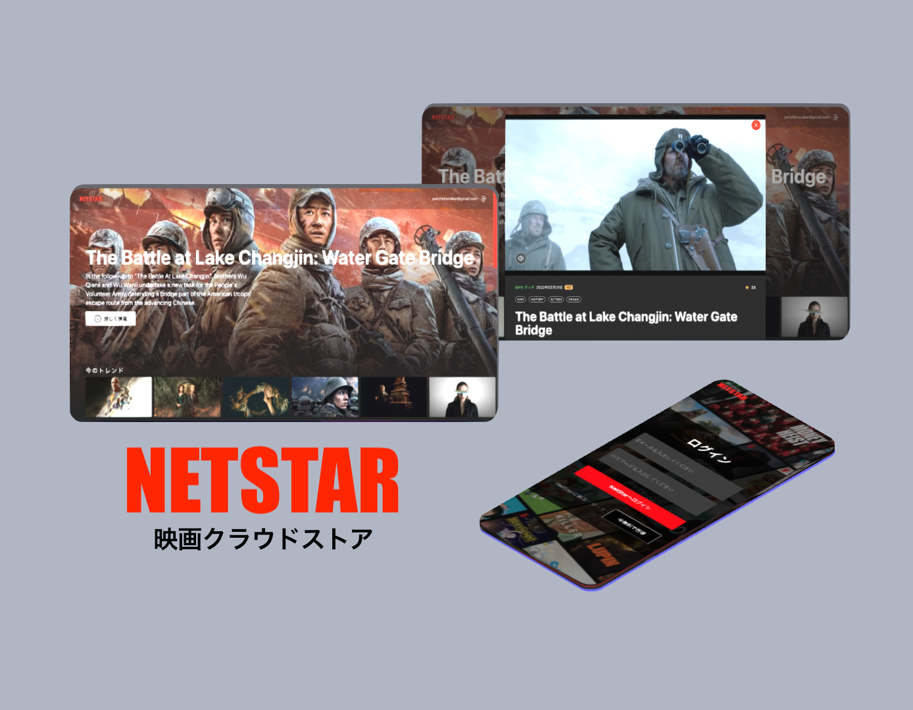
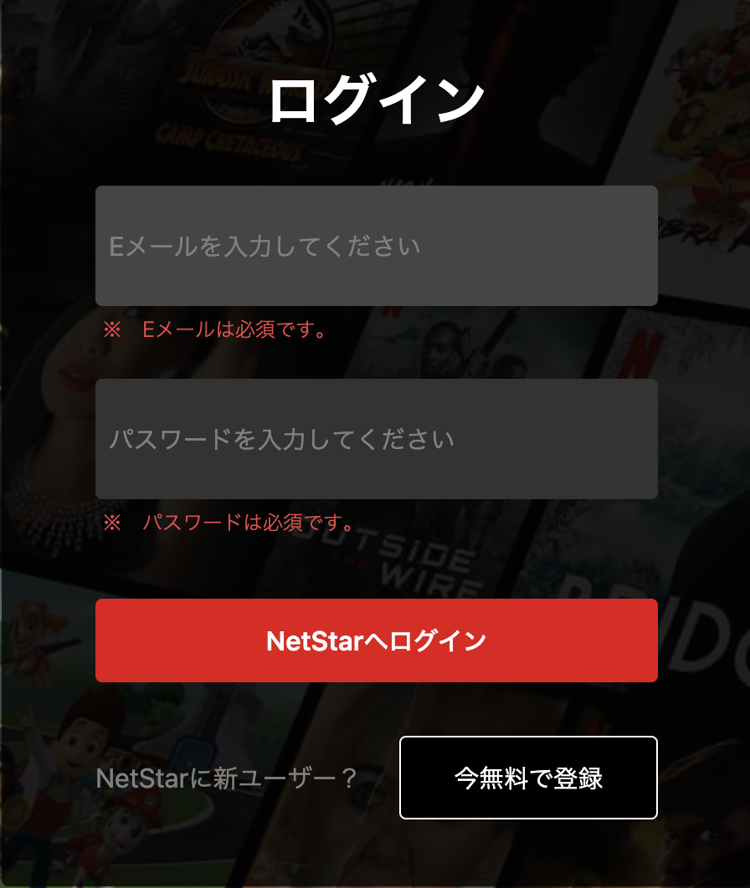
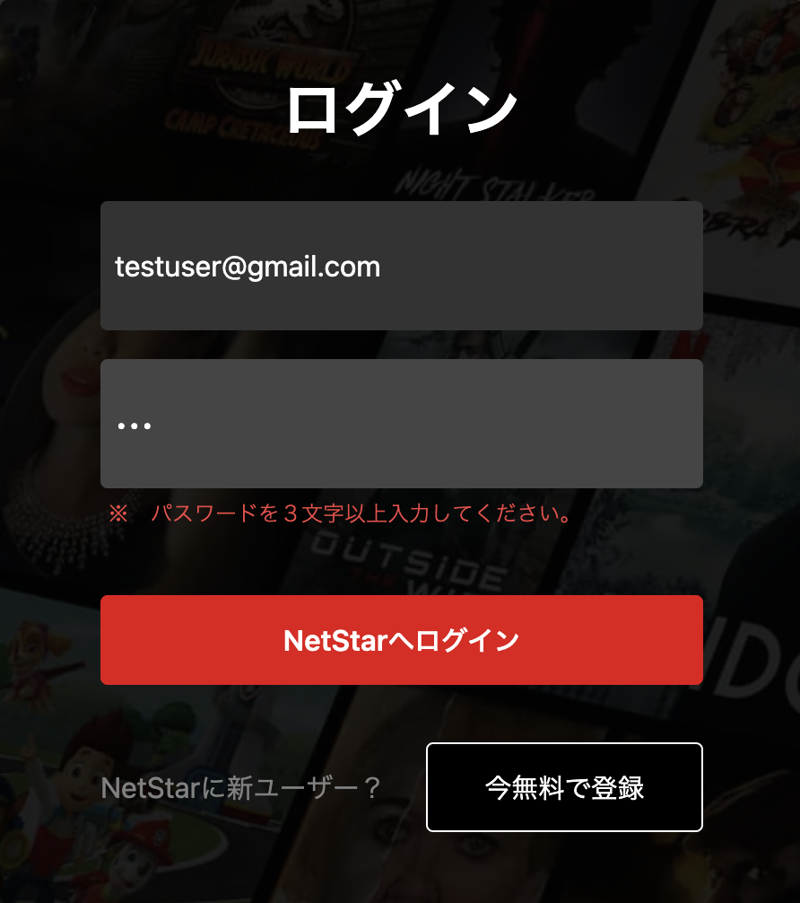
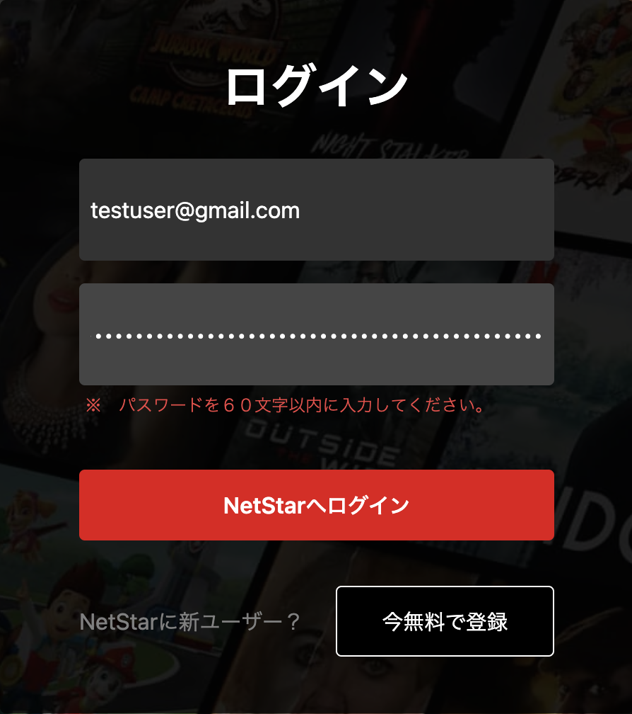
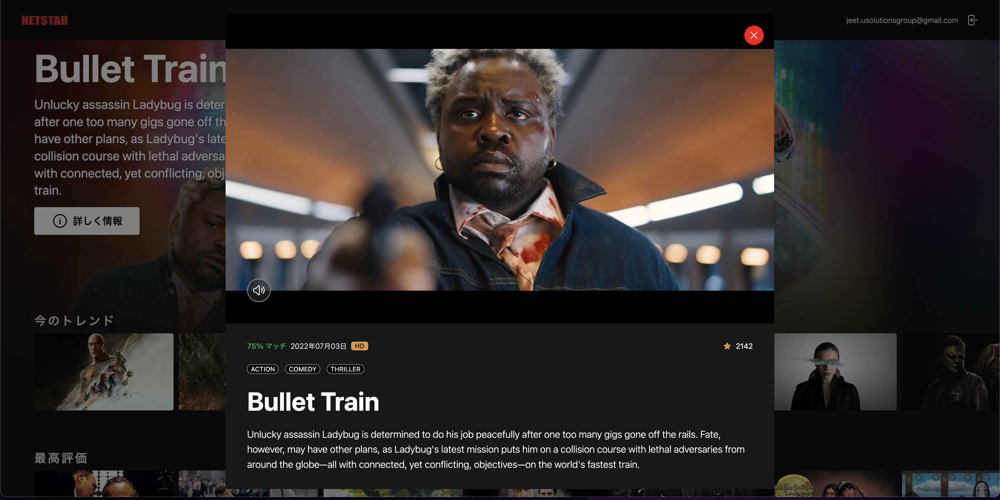
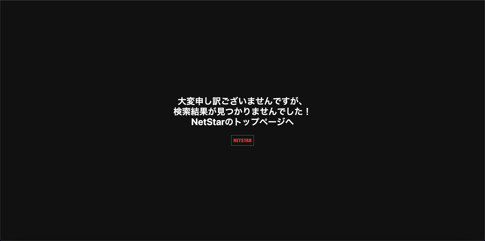

# NetStar 映画 クラウドストアとは？

NetStar 映画 クラウドストアは クラウド上で、IMDB API から取得された映画の ストアです。**「今のトレンド」**、**「最高評価」**、**「アクションスリラー」**、**「コメディ」**、**「ホラー映画」**、**「ロマンス映画」**、**「ドキュメンタリー」** の映画のコレクションです。コレクションから特定映画の情報をする時、トレーラーのプレー、映画の情報を表示する事もできます。どんな端末でも本アプリはレスポンシブ対応です。

# 本番環境の URL

https://netstar.vercel.app/

# 開発用

**ツール**：HTML、CSS、TailwindCSS、JavaScript、TypeScript、ReactJS、NextJS

**映画取得の API**：TMDB API (https://www.themoviedb.org/)

**ユーザー認証用**：Firebase

**デプロイ**：Vercel

**開発期間**：2022 年 10 月 01 日 〜 2022 年 10 月 31 日

# 画面キャプチャと詳しく説明

**ログイン画面**

本アプリにアクセスするため、ユーザーのメールとパスワードの入力が必要です。

NetStar に新ユーザーの場合、メールとパスワードを入力して、**「今無料で登録」** ボタンをクリックしてください。以前 NetStar を使用された方は、メールとパスワードを入力して、**「NetStar へログイン」** ボタンをクリックしてください。

メールとパスワードを未入力の場合、以下のエラーメッセージが出力します。

パスワードのサイズは４文字以下の場合、以下のエラーメッセージが出力します。

パスワードのサイズは６０文字以上の場合、以下のエラーメッセージが出力します。

**映画一覧画面**

**映画詳細画面**

特定映画の情報を取得時、**「詳しく情報」** ボタンがコレクション（**「今のトレンド」**、**「最高評価」**、**「アクションスリラー」**、**「コメディ」**、**「ホラー映画」**、**「ロマンス映画」**、**「ドキュメンタリー」**）から映画の画像にクリックしてください。クリックすると、以下のポップアップ・ダイヤログ画面が表示します。

自動で映画のトレーラーのプレーになります。映画の音をミュート・アンミュートする事ができます。リリーズ日、Votes 数、映画のタイプと説明が表示されます。

ユーザーがログアウトの希望場合、メールアドレスの隣の右上にあるアイコンをクリックしてください。その後、ログイン画面が表示されます。

**ページが無い場合の画面**

ブラウザの URL でユーザーが自由で何も入力して、「Enter」ボタンを押した後、サーバーでそのページが見つからない場合、以下の画面が表示されます。**「NetStar」** ボタンをクリックして、トップ画面に戻る事ができます。

# ソース関係のドキュメント

[開発用 README ファイル](netstar-app/README.md)

# 作成者、開発者

ジート　ゼットエイチ　コンドカー
